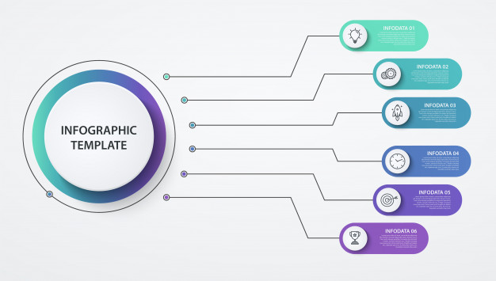

# Informations and Knowledge Management

It's been almost all my life that I've been struggling to structure and organize my learnings.
I am someone that is always reading and learning new things. Could they be usefull or not to me.

Recently I've been putting together all my ideas and experiences into this.
And I finally came with up with a versatile but simplistic approach.

